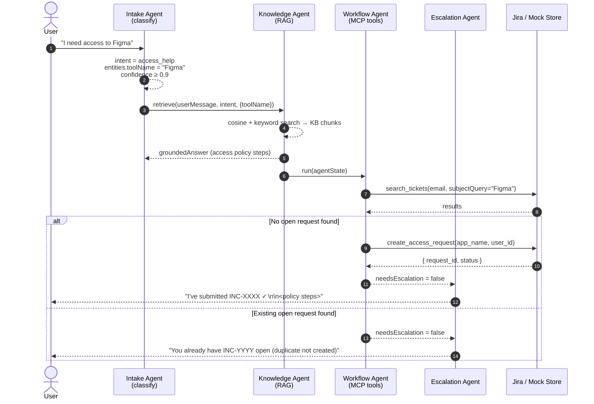

# Access Help — Use Case Flow

Covers PRD §14.1. Triggered when the user asks for access to a software tool (e.g. Figma, Slack, Notion).

The **Knowledge Agent** retrieves the access policy from the KB so the response
includes onboarding steps alongside the ticket reference.
A **duplicate-check** (`search_tickets`) fires before `create_access_request`
so the agent never opens a second ticket for the same tool.

## Decision rules

| Condition | Outcome |
|---|---|
| `toolName` extracted + no open duplicate | `create_access_request` → respond |
| `toolName` extracted + duplicate found | Return existing ticket ID — no new ticket |
| `toolName` missing (underspecified) | `escalated = true`, ask user to name the tool |
| Tool not on policy list | `create_access_request` anyway (procurement path) |
