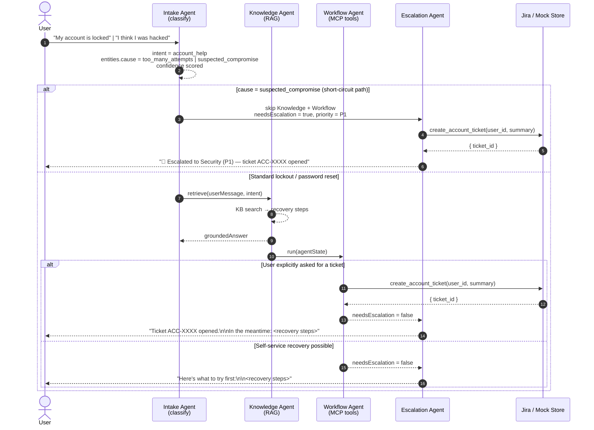

# Account Help — Use Case Flow

Covers PRD §14.2. Triggered when the user reports an account issue: lockout, MFA reset,
password change, or — critically — **suspected compromise**.

The **compromise short-circuit** bypasses normal workflow and jumps straight to P1 escalation.
This path is tested by two dedicated scenarios including a regression test for natural-language
phrasing that doesn't contain the literal word "compromised".

## Decision rules

| Condition | Outcome |
|---|---|
| `cause = suspected_compromise` | Skip Knowledge + Workflow → P1 escalation + ticket |
| Standard lockout + user wants ticket | `create_account_ticket` → respond with steps |
| Standard lockout + self-service possible | Return recovery steps, no ticket |
| Ambiguous ("I can't log in") | Respond with steps, `confidence < 0.85` flagged |
