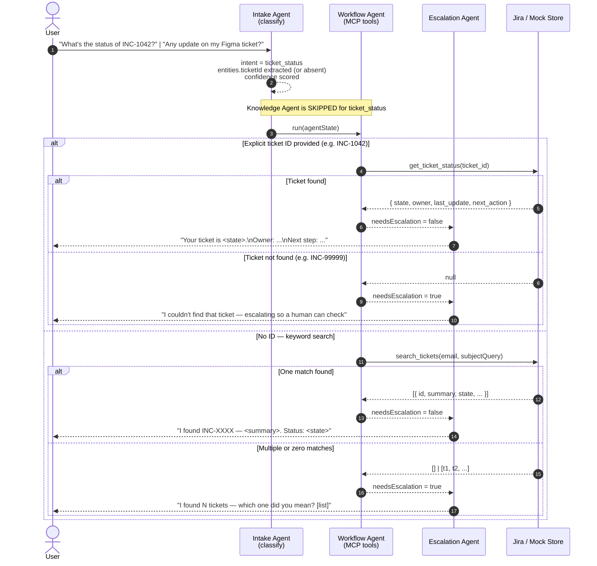

# Ticket Status — Use Case Flow

Covers PRD §14.3. Triggered when the user asks about an existing ticket's status.

**Key routing difference:** `ticket_status` intent skips the Knowledge Agent entirely — the
tool call to Jira/mock returns structured data so there is no policy document to retrieve.

Two sub-paths are shown: lookup by explicit ticket ID (`INC-1042`) and keyword-based search
(`search_tickets`) when no ID is provided.

## Decision rules

| Condition | Outcome |
|---|---|
| Valid ticket ID → found | Return structured status, no escalation |
| Valid ticket ID → not found | Escalate for human check |
| No ID + keyword match (1 result) | Return that ticket's status |
| No ID + multiple matches | List choices, escalate for clarification |
| No ID + no matches | Escalate |
| Stale ticket (`state = stale`) | Return status with "may be stuck" explanation |
